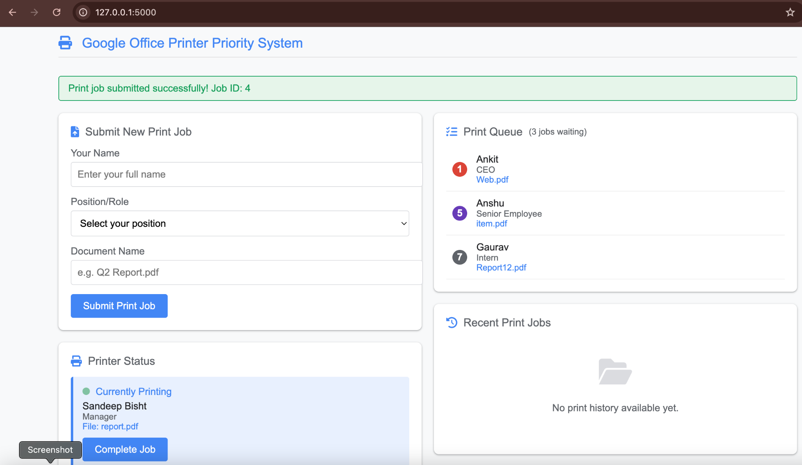

# Smart Print Scheduler

A Flask-based Smart Print Scheduler that uses a Priority Queue (Heap) to manage and prioritize office print jobs based on employee roles.

## Features

* Priority-based print scheduling
* Role-based job prioritization
* Real-time printer status monitoring
* Dynamic queue management
* Print history tracking
* Responsive web interface
* Automatic queue updates using JavaScript and AJAX

## Technologies Used

### Backend

* Python
* Flask

### Frontend

* HTML
* CSS
* JavaScript
* jQuery

### Data Structure

* Priority Queue (Heap)

---

## Home Page


The landing page allows users to submit print jobs, monitor printer status, view the queue, and track completed jobs.

---

## Priority Configuration


The system assigns priorities based on employee roles.

| Role             | Priority |
| ---------------- | -------- |
| CEO              | 1        |
| Director         | 2        |
| Manager          | 3        |
| Team Lead        | 4        |
| Senior Employee  | 5        |
| Regular Employee | 6        |
| Intern           | 7        |

Lower priority numbers indicate higher scheduling priority.

---

## Queue Management



Submitted jobs are automatically arranged using a Heap-based Priority Queue. Higher-priority jobs are processed before lower-priority jobs.

---

## Print History


Completed print jobs are stored and displayed with completion timestamps for tracking and auditing purposes.

---

## Scheduling Logic

The scheduler follows **Non-Preemptive Priority Scheduling**:

* The currently printing job is never interrupted.
* New jobs are inserted into a Priority Queue.
* After the current job completes, the highest-priority waiting job is selected.
* Jobs with the same priority are processed based on arrival time.

---

## Project Structure

```text
smart-print-scheduler/
│
├── app.py
├── README.md
├── screenshots/
│   ├── home-page.png
│   ├── priority-list.png
│   ├── queue-management.png
│   └── print-history.png
│
└── templates/
    └── index.html
```

## How to Run

```bash
git clone https://github.com/SandeepBisht672005/smart-print-scheduler.git
cd smart-print-scheduler
pip3 install flask
python3 app.py
```

Open your browser and visit:

```text
http://127.0.0.1:5000
```

## Author

**Sandeep Bisht**
