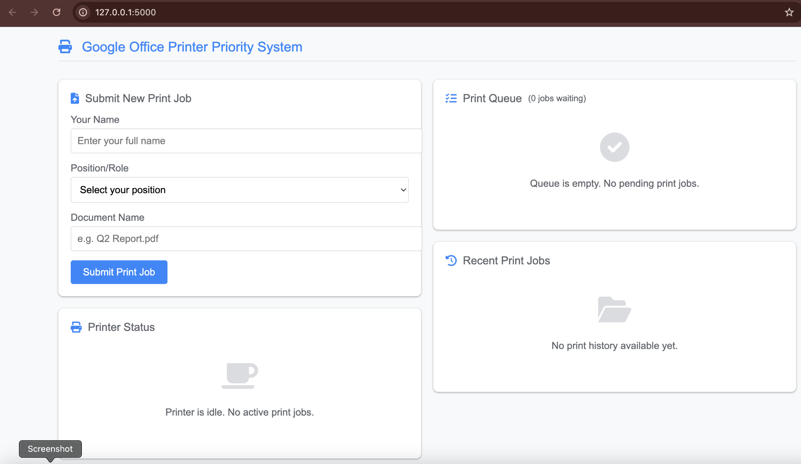
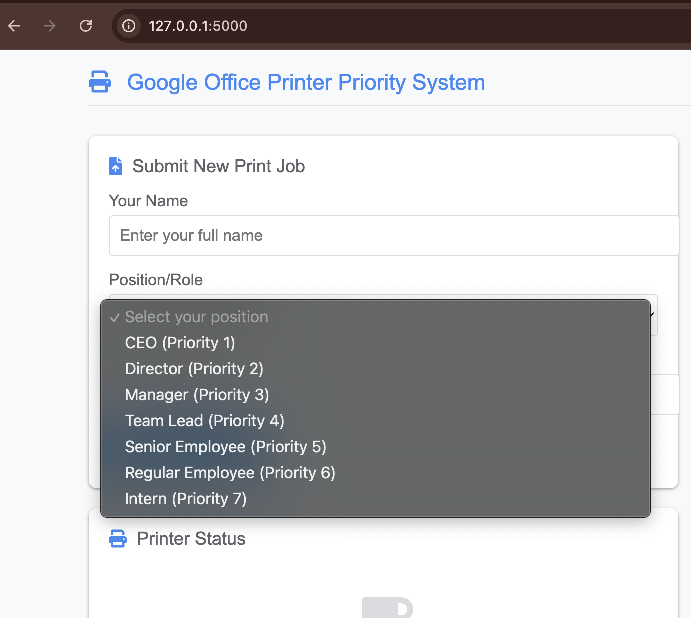
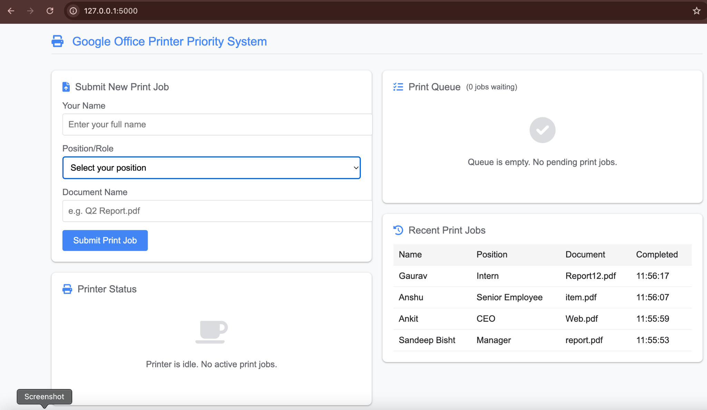

# Smart Print Scheduler

A priority-based office print scheduling system developed using Flask and Python. The application uses a Priority Queue (Heap) to manage and process print jobs according to employee hierarchy.

## Features

* Priority-based print scheduling
* Role-based job prioritization
* Real-time printer status monitoring
* Dynamic queue management
* Print history tracking
* Responsive web interface

## Technologies Used

### Backend

* Python
* Flask

### Frontend

* HTML
* CSS
* JavaScript
* jQuery

### Data Structure

* Priority Queue (Heap)

## Home Page



## Priority Configuration



The system assigns priorities based on employee roles.

## Queue Management


Jobs are automatically sorted and processed according to priority.

## Print History



Completed jobs are stored and displayed with timestamps.

## Scheduling Logic

* CEO → Priority 1
* Director → Priority 2
* Manager → Priority 3
* Team Lead → Priority 4
* Senior Employee → Priority 5
* Regular Employee → Priority 6
* Intern → Priority 7

The scheduler follows a Non-Preemptive Priority Scheduling approach using a Heap-based Priority Queue.

## How to Run

```bash
pip3 install flask
python3 app.py
```

Open:

http://127.0.0.1:5000
